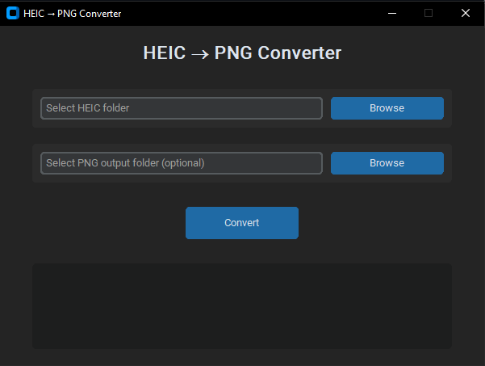

# HEIC to PNG Converter

This project provides a modern GUI-based application for converting HEIC images to PNG format. It uses **`customtkinter`** for a sleek, dark-themed interface, **`pillow-heif`** for reading HEIC files, and **`Pillow`** for saving PNG images.


---

## 🖥️ GUI Preview



---

## ✨ Features

* 🖼️ Convert all `.HEIC` files in a selected folder to `.PNG` format
* 💡 Modern, responsive GUI built with `customtkinter`
* ⚙️ Option to select input and output folders separately
* 🚫 Automatically **skips files** that already exist in the output directory
* 📜 Real-time conversion logs shown in the interface
* 🧱 Error handling and completion messages

---

## 🧩 Requirements

You need the following libraries installed:

```bash
pip install pillow pillow-heif customtkinter
```

---

## 🚀 Usage

1. Run the main script:

   ```bash
   python main.py
   ```

2. In the GUI:

   * Click **Browse** to select your input folder containing HEIC files.
   * (Optional) Choose an output folder for PNG files.
   * Press **Convert** to start the conversion.

3. The app will:

   * Convert each HEIC file to PNG.
   * Skip already converted PNGs with the same name.
   * Display progress and logs in the window.

---

## 🗒️ Notes

* The application was developed and tested on **Windows 10**.
* Default theme is **dark mode**, but can be changed to light by editing:

  ```python
  ctk.set_appearance_mode("light")
  ```
* Converted images retain the same filename with a `.png` extension.

---

## 🧱 Example Output

```
📄 Converting: IMG_001.heic
⚠️ Skipped (already exists): IMG_001.png
✅ Saved: IMG_002.png
✅ Done! 1 converted, 1 skipped.
```

---

## 📦 Future Updates

Planned improvements:

* Progress bar for real-time conversion tracking
* Optional image preview window
* Support for batch subfolder conversion

---

**Author:** Yekta T.
**Status:** Active (Modern GUI version)
